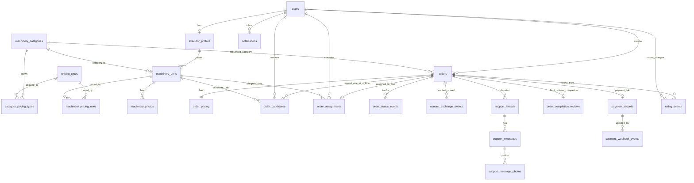

# Доменная модель и ERD (MVP)

## 1) Цель документа

Документ описывает минимальную доменную модель для запуска MVP маркетплейса спецтехники:
- без обязательной «Безопасной сделки»;
- без внутреннего денежного баланса;
- с поддержкой прямой оплаты и последующего подключения платежного провайдера.

Модель выровнена с `USER_SCENARIOS.md`.

## 2) Основные сущности

### `users`

Один пользователь может быть и клиентом, и исполнителем.

Ключевые поля:
- `id` (UUID, PK);
- `phone` (уникальный, логин);
- `full_name`;
- `contact_phone` (nullable) — контакт, не логин; вместе с `full_name` обязателен для создания и принятия заказа;
- `messengers_json` (JSONB: массив `{ "name": "строка", "url": "строка" }`; в UI кнопка «добавить мессенджер» добавляет ещё одну пару полей);
- `is_client_enabled` (bool);
- `is_executor_enabled` (bool);
- `rating_as_client` (внутренний, не для UI; отмена, срыв переговоров, несогласие с ценой);
- `rating_as_executor` (внутренний, не для UI; те же события плюс таймаут −2);
- `created_at`, `updated_at`.

### `executor_profiles`

Расширение роли исполнителя.

Ключевые поля:
- `id` (UUID, PK);
- `user_id` (FK -> users.id, unique);
- `accepts_orders` (bool);
- `avatar_url` (nullable);
- `about` (nullable);
- `is_verified`;
- `subscription_status` (`trial`, `active`, `paused`, `expired`);
- `created_at`, `updated_at`.

### `machinery_categories`

Справочник типов транспорта. Стартовый набор и связь с тарифами — `TARIFF_TYPES.md`.

Ключевые поля:
- `id` (UUID, PK);
- `code` (уникальный);
- `name_ru`;
- `is_active`;
- `created_at`, `updated_at`.

### `pricing_types`

Справочник типов тарифа.

Ключевые поля:
- `code` (PK: `hour`, `shift`, `day`, `month`, `trip`, `km`);
- `name_ru`;
- `is_active`.

### `category_pricing_types`

Какие тарифы можно выбрать для категории. Исполнитель видит только эти типы.

Ключевые поля:
- `category_id` (FK -> machinery_categories.id);
- `pricing_type_code` (FK -> pricing_types.code);
- PK `(category_id, pricing_type_code)`.

### `machinery_units`

Единица транспорта исполнителя. У одного профиля неограниченное число единиц.

Ключевые поля:
- `id` (UUID, PK);
- `executor_profile_id` (FK -> executor_profiles.id);
- `category_id` (FK -> machinery_categories.id) — тип транспорта;
- `address_text` — локация, поле с автокомплитом;
- `location_lat`, `location_lng`;
- `deleted_at` (nullable, мягкое удаление);
- `created_at`, `updated_at`.

Правила:
- создавать и менять может только владелец профиля;
- лимита на количество единиц нет;
- подсказки автокомплита локации включают адреса других единиц этого исполнителя;
- в поиске участвует каждая неудалённая единица, если у владельца `accepts_orders = true` и есть хотя бы один тариф из разрешённых категории;
- точка на карте — локация этой единицы; несколько единиц с одной точкой группируются.

### `machinery_photos`

Фотографии единицы транспорта. На вход — файлы, сервер сохраняет и отдаёт `url`.

Ключевые поля:
- `id` (UUID, PK);
- `machinery_unit_id` (FK -> machinery_units.id);
- `url`;
- `sort_order`;
- `created_at`.

### `machinery_pricing_rules`

Тарифы единицы транспорта. Не относятся к исполнителю в целом. Платформа не задаёт `base_rate`.

Ключевые поля:
- `id` (UUID, PK);
- `machinery_unit_id` (FK -> machinery_units.id);
- `pricing_type` (FK -> pricing_types.code);
- `currency` (`RUB`);
- `base_rate` (ставка, заданная исполнителем; > 0);
- `is_active` (bool, default true);
- `meta_json` (JSONB: расширяемые параметры);
- `created_at`, `updated_at`.

Правила:
- тип должен быть разрешён категории единицы через `category_pricing_types`;
- у единицы может быть несколько тарифов разных типов;
- уникальный индекс `(machinery_unit_id, pricing_type)` среди активных правил;
- менять тарифы может только владелец техники.

### `orders`

Корневая сущность заказа. Обычно создаётся в момент отправки запроса исполнителю. Исключение: «искать снова» после полной отмены — новый заказ в `published` без кандидата (`repeated_from_order_id`).

Ключевые поля:
- `id` (UUID, PK);
- `client_user_id` (FK -> users.id);
- `category_id` (FK -> machinery_categories.id);
- `settlement_mode` (`direct_payment`, `secure_deal`);
- `search_mode` (`urgent`, `planned`);
- `status` (`published`, `in_negotiation`, `assigned`, `awaiting_payment`, `in_progress`, `completed`, `disputed`, `cancelled`);
- `cancel_reason_code` (nullable, из справочника; фильтр в админке);
- `cancel_reason_text` (nullable, обязателен при `other`);
- `cancelled_by_user_id` (nullable);
- `cancelled_by_role` (nullable: `client` | `executor` | `system`);
- `completion_review_deadline_at` (nullable: переход в `completed` + 1 сутки);
- `payment_deadline_at` (nullable: вход в `awaiting_payment` + 1 сутки);
- `dispute_appeal_used` (bool, default false) — апелляция уже подана;
- `repeated_from_order_id` (nullable, FK -> orders.id) — новый заказ после «искать снова» с `cancelled` или с принятого `completed`;
- `address_text` (nullable);
- `location_lat`, `location_lng` (nullable);
- `planned_start_at` (nullable, для планового);
- `planned_duration_minutes` (nullable, для планового);
- `description` (nullable);
- `created_at`, `updated_at`.

### `order_pricing`

Оговоренная цена конкретного заказа. Её указывает заказчик после переговоров, не копируется автоматически из тарифа транспорта.

Ключевые поля:
- `id` (UUID, PK);
- `order_id` (FK -> orders.id, unique);
- `currency` (`RUB`);
- `agreed_amount` (nullable до отправки на подтверждение исполнителю);
- `created_at`, `updated_at`.

### `order_candidates`

Запрос конкретному исполнителю. Одновременно ожидающих ответа кандидатов на заказ — не больше одного.

Ключевые поля:
- `id` (UUID, PK);
- `order_id` (FK -> orders.id);
- `executor_user_id` (FK -> users.id);
- `machinery_unit_id` (FK -> machinery_units.id);
- `candidate_status` (`notified`, `viewed`, `accepted`, `declined`, `expired`, `withdrawn`, `negotiation_rejected`);
- `reject_reason_code` (nullable);
- `reject_reason_text` (nullable);
- `notified_at`;
- `response_deadline_at` (notified_at + 5 минут для первого ответа);
- `responded_at` (nullable);
- `created_at`, `updated_at`.

Ограничения:
- не более одного кандидата в статусе `notified` или `viewed` на заказ;
- нельзя создать новый запрос тому же `executor_user_id` на этот `order_id`, если уже есть `declined` или `negotiation_rejected`;
- после `expired` и после `withdrawn` новый запрос тому же исполнителю разрешён.

### `order_assignments`

Фиксируется, когда оба приняли оговоренную цену: переход в `awaiting_payment` (`secure_deal`) или сразу в `in_progress` (`direct_payment`).

Ключевые поля:
- `id` (UUID, PK);
- `order_id` (FK -> orders.id);
- `executor_user_id` (FK -> users.id);
- `machinery_unit_id` (FK -> machinery_units.id, nullable);
- `assigned_at`;
- `created_at`.

Ограничение:
- уникальный индекс по `order_id`.

Пока статус `assigned`, этой записи нет: отказ цены возвращает в `in_negotiation` без назначения.

### `order_status_events`

История переходов состояний заказа.

Ключевые поля:
- `id` (UUID, PK);
- `order_id` (FK -> orders.id);
- `from_status`;
- `to_status`;
- `actor_user_id` (nullable);
- `reason_code` (nullable);
- `payload_json` (nullable);
- `created_at`.

### `contact_exchange_events`

Фиксация обмена контактами после первого «принять», до переговоров.

Ключевые поля:
- `id` (UUID, PK);
- `order_id` (FK -> orders.id);
- `client_user_id` (FK -> users.id);
- `executor_user_id` (FK -> users.id);
- `created_at`.

Канал обмена отдельным полем не задан: в карточке после принятия показываются `users.contact_phone` и `users.messengers_json` обеих сторон.

### `support_threads`

Тред спора. На заказ не больше двух: первый спор и одна апелляция. Одновременно открыт только один.

Ключевые поля:
- `id` (UUID, PK);
- `order_id` (FK -> orders.id);
- `opened_by_user_id` (FK -> users.id, nullable если спор открыл провайдер/`expires_at`);
- `is_appeal` (bool);
- `parent_thread_id` (nullable, FK -> support_threads.id);
- `reason_code` (nullable: код причины открытия; у апелляции может быть текст без кода справочника);
- `reason_text` (nullable, обязателен при `other` и у апелляции);
- `status` (`open`, `closed`);
- `closed_to_status` (nullable: `completed` | `cancelled` | `in_progress`);
- `closed_by_admin` (nullable);
- `created_at`, `updated_at`.

Создаётся кнопкой спора, непринятием работы, возвратом холда провайдером или апелляцией после закрытия админом. Закрывается только из админки. На этот заказ нельзя вернуть поиск исполнителей.

Фото к причине не хранятся. Фото — вложения сообщений.

### `support_messages`

Сообщения треда. Из **приложения** пишут клиент и исполнитель. Админ пишет только из **админки**.

Ключевые поля:
- `id` (UUID, PK);
- `thread_id` (FK -> support_threads.id);
- `author_kind` (`client`, `executor`, `admin`);
- `author_user_id` (FK -> users.id, nullable для админа, если персонал не в `users`);
- `body` (текст);
- `created_at`.

В поле сообщения можно прикрепить фото (файлы).

### `support_message_photos`

Вложения к сообщению треда.

Ключевые поля:
- `id` (UUID, PK);
- `message_id` (FK -> support_messages.id);
- `url`;
- `sort_order`;
- `created_at`.

Вход админа в консоль поддержки — часть MVP (не мобильное приложение).

### `notifications`

Лента уведомлений пользователя (клиент и исполнитель). Экран «все уведомления».

Ключевые поля:
- `id` (UUID, PK);
- `user_id` (FK -> users.id);
- `order_id` (FK -> orders.id, nullable);
- `type` (строка события: запрос, отказ, таймаут, цена, оплата, сдача, спор, отмена, …);
- `payload_json` (nullable);
- `read_at` (nullable);
- `created_at`.

### `order_completion_reviews`

Действие клиента после того, как исполнитель перевёл заказ в `completed`.

Ключевые поля:
- `id` (UUID, PK);
- `order_id` (FK -> orders.id, unique);
- `client_user_id` (FK -> users.id);
- `decision` (`confirmed`, `declined`);
- `source` (`client` | `auto_timeout`);
- `created_at`.

При `declined`: переход в `disputed`, тред, причина и при `other` текст. Фото — в сообщениях треда. После `completed` отменить заказ нельзя. При автоприёмке (`auto_timeout`) — как `confirmed`, минус рейтингу клиента.

### `rating_events`

Журнал внутренних баллов. Правила дельт — `RATING_PLAN.md`. Таймаут 5 минут: `event_type = timeout`, `reason_code = response_timeout`, `delta = -2` исполнителю. Автоприёмка: `late_confirm`, клиенту **−3**. Автоотмена неоплаты: `payment_timeout`, клиенту **−3**.

Ключевые поля:
- `id` (UUID, PK);
- `user_id` (FK -> users.id);
- `role` (`client`, `executor`);
- `order_id` (FK -> orders.id, nullable);
- `event_type` (`success`, `penalty`, `timeout`, `late_confirm`, `payment_timeout`, `admin_adjust`);
- `reason_code` (nullable);
- `stage` (nullable, статус заказа в момент события);
- `delta` (int);
- `status` (`applied`, `pending_admin`);
- `created_at`.

Для `other` сначала `pending_admin` и `delta = 0`.

### `payment_records`

Техническая запись интеграции с провайдером платежей (не кошелек).

Ключевые поля:
- `id` (UUID, PK);
- `order_id` (FK -> orders.id);
- `provider_code` (например, `yookassa`);
- `provider_payment_id` (уникальный в провайдере);
- `payment_status` (`not_required`, `pending`, `authorized`, `captured`, `failed`, `cancelled`, `refunded`);
- `amount`;
- `currency` (`RUB`);
- `commission_amount` (nullable);
- `raw_payload_json` (JSONB);
- `created_at`, `updated_at`.

### `payment_webhook_events`

Журнал входящих вебхуков провайдера.

Ключевые поля:
- `id` (UUID, PK);
- `provider_code`;
- `provider_event_id` (уникальный);
- `provider_payment_id`;
- `event_type`;
- `payload_json` (JSONB);
- `processed_at` (nullable);
- `created_at`.

## 3) ERD (Mermaid)

## 4) Ключевые инварианты домена

- Один пользователь может одновременно быть клиентом и исполнителем.
- У одного `executor_profile` неограниченное число `machinery_units`.
- Тарифы принадлежат единице транспорта и должны быть разрешены её категории (`category_pricing_types`).
- Контакты принадлежат пользователю; в поиске не показываются, открываются после первого принятия. Без `full_name` и `contact_phone` нельзя создать заказ и нельзя принять запрос.
- В списке поиска — карточка каждой единицы транспорта; на карте одинаковые координаты группируются.
- Исполнитель с `declined` / `negotiation_rejected` по заказу скрыт; после `expired` и `withdrawn` его можно запросить снова.
- Отмена, срыв переговоров и несогласие с ценой пишут причину и двигают внутренние рейтинги.
- Полная отмена кнопкой только до `in_progress`; причина на `orders` для фильтра в админке. После начала работы — только спор.
- Таймаут 5 минут: исполнителю −2 в рейтинге.
- Срок ответа клиента на сдачу: 1 сутки, иначе автоприёмка.
- Срок оплаты безопасной сделки: 1 сутки на `awaiting_payment`, иначе автоотмена.
- Не больше двух тредов спора на заказ (спор + апелляция). Одновременно открыт один.
- Свою технику заказать нельзя.
- Админка (тред и закрытие спора) входит в MVP; из приложения админ не действует.
- Для реальных денег источником истины остается платежный провайдер.
- В `direct_payment` поле `payment_records` может отсутствовать.
- В `secure_deal` должен существовать `payment_record` и обрабатываться вебхуки провайдера.

## 5) Индексы и ограничения (минимум)

- `users.phone` — уникальный.
- `executor_profiles.user_id` — уникальный.
- `machinery_categories.code` — уникальный.
- `pricing_types.code` — PK.
- `category_pricing_types(category_id, pricing_type_code)` — PK.
- `machinery_pricing_rules(machinery_unit_id, pricing_type)` — уникальный среди активных правил.
- `order_candidates`: не более одного `notified`/`viewed` на `order_id`; запрет нового запроса при существующем `declined` или `negotiation_rejected` для пары заказ–исполнитель.
- `support_threads`: не больше одного `open` на `order_id`; не больше одной апелляции на заказ;
- `payment_webhook_events.provider_event_id` — уникальный (идемпотентность вебхуков).
- `payment_records(provider_code, provider_payment_id)` — уникальный.

Рекомендуемые индексы:
- `machinery_units(executor_profile_id)`;
- `executor_profiles(accepts_orders)`;
- `order_candidates(response_deadline_at)` — обработка таймаута 5 минут;
- `orders(cancel_reason_code)`, `orders(cancelled_by_role)` — фильтр в админке;
- `orders(repeated_from_order_id)`;
- `notifications(user_id, created_at)`.

## 6) Что можно отложить

- Детальный календарь доступности с повторяющимися графиками.
- Показ рейтинга в UI (формула на бэкенде уже в `RATING_PLAN.md`).
- Корпоративный контур (`Company*`) до подтвержденного спроса.
