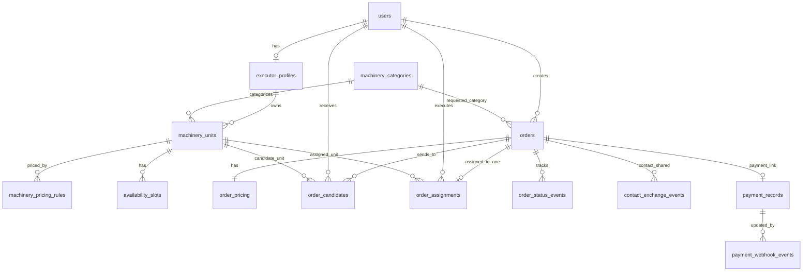

# Доменная модель и ERD (MVP)

## 1) Цель документа

Документ описывает минимальную доменную модель для запуска MVP маркетплейса спецтехники:
- без обязательной «Безопасной сделки»;
- без внутреннего денежного баланса;
- с поддержкой прямой оплаты и последующего подключения платежного провайдера.

## 2) Основные сущности

### `users`

Один пользователь может быть и клиентом, и исполнителем.

Ключевые поля:
- `id` (UUID, PK);
- `phone` (уникальный);
- `full_name`;
- `is_client_enabled` (bool);
- `is_executor_enabled` (bool);
- `rating_as_client` (nullable);
- `rating_as_executor` (nullable);
- `created_at`, `updated_at`.

### `executor_profiles`

Расширение роли исполнителя.

Ключевые поля:
- `id` (UUID, PK);
- `user_id` (FK -> users.id, unique);
- `about`;
- `service_radius_km`;
- `is_verified`;
- `subscription_status` (`trial`, `active`, `paused`, `expired`);
- `created_at`, `updated_at`.

### `machinery_categories`

Справочник категорий спецтехники.

Ключевые поля:
- `id` (UUID, PK);
- `code` (уникальный: `tow_truck`, `excavator`, `crane` и т.д.);
- `name_ru`;
- `is_active`;
- `created_at`, `updated_at`.

### `machinery_units`

Единица техники исполнителя.

Ключевые поля:
- `id` (UUID, PK);
- `executor_profile_id` (FK -> executor_profiles.id);
- `category_id` (FK -> machinery_categories.id);
- `title`;
- `capacity_payload` (nullable);
- `capacity_tonnage` (nullable);
- `status` (`available`, `busy`, `offline`);
- `base_location_lat`, `base_location_lng`;
- `created_at`, `updated_at`.

### `machinery_pricing_rules`

Гибкие правила расчета цены по технике/категории.

Ключевые поля:
- `id` (UUID, PK);
- `machinery_unit_id` (FK -> machinery_units.id);
- `pricing_type` (`hour`, `shift`, `trip`, `km`, `fixed`);
- `currency` (`RUB`);
- `base_rate`;
- `min_hours` (nullable);
- `min_shifts` (nullable);
- `meta_json` (JSONB: расширяемые параметры);
- `created_at`, `updated_at`.

### `availability_slots`

Плановая доступность техники (можно упростить в первой версии).

Ключевые поля:
- `id` (UUID, PK);
- `machinery_unit_id` (FK -> machinery_units.id);
- `starts_at`;
- `ends_at`;
- `status` (`free`, `reserved`, `blocked`);
- `created_at`, `updated_at`.

### `orders`

Корневая сущность заказа.

Ключевые поля:
- `id` (UUID, PK);
- `client_user_id` (FK -> users.id);
- `category_id` (FK -> machinery_categories.id);
- `settlement_mode` (`direct_payment`, `secure_deal`);
- `search_mode` (`urgent`, `planned`);
- `status` (`draft`, `published`, `in_negotiation`, `assigned`, `in_progress`, `completed`, `cancelled`);
- `address_text`;
- `location_lat`, `location_lng`;
- `planned_start_at` (nullable для срочного);
- `planned_duration_minutes` (nullable);
- `description` (nullable);
- `created_at`, `updated_at`.

### `order_pricing`

Зафиксированные или расчетные параметры стоимости конкретного заказа.

Ключевые поля:
- `id` (UUID, PK);
- `order_id` (FK -> orders.id, unique);
- `pricing_type` (`hour`, `shift`, `trip`, `km`, `fixed`);
- `currency` (`RUB`);
- `agreed_amount` (nullable для прямой оплаты до согласования);
- `calc_params_json` (JSONB: например, `hours`, `distance_km`, `tonnage`);
- `created_at`, `updated_at`.

### `order_candidates`

Исполнители, которым отправлен заказ.

Ключевые поля:
- `id` (UUID, PK);
- `order_id` (FK -> orders.id);
- `executor_user_id` (FK -> users.id);
- `machinery_unit_id` (FK -> machinery_units.id, nullable);
- `candidate_status` (`notified`, `viewed`, `accepted`, `declined`, `expired`);
- `responded_at` (nullable);
- `created_at`, `updated_at`.

Ограничение:
- уникальный индекс `(order_id, executor_user_id)` для исключения дублей рассылки.

### `order_assignments`

Факт назначения исполнителя.

Ключевые поля:
- `id` (UUID, PK);
- `order_id` (FK -> orders.id);
- `executor_user_id` (FK -> users.id);
- `machinery_unit_id` (FK -> machinery_units.id, nullable);
- `assigned_at`;
- `created_at`.

Ограничение:
- уникальный индекс по `order_id` (ровно один назначенный исполнитель).

### `order_status_events`

История переходов состояний заказа.

Ключевые поля:
- `id` (UUID, PK);
- `order_id` (FK -> orders.id);
- `from_status`;
- `to_status`;
- `actor_user_id` (nullable);
- `reason_code` (nullable);
- `payload_json` (nullable);
- `created_at`.

### `contact_exchange_events`

Фиксация факта обмена контактами после принятия.

Ключевые поля:
- `id` (UUID, PK);
- `order_id` (FK -> orders.id);
- `client_user_id` (FK -> users.id);
- `executor_user_id` (FK -> users.id);
- `exchange_channel` (`in_app_chat`, `phone_visible`, `other`);
- `created_at`.

### `payment_records`

Техническая запись интеграции с провайдером платежей (не кошелек).

Ключевые поля:
- `id` (UUID, PK);
- `order_id` (FK -> orders.id);
- `provider_code` (например, `yookassa`);
- `provider_payment_id` (уникальный в провайдере);
- `payment_status` (`not_required`, `pending`, `authorized`, `captured`, `failed`, `cancelled`, `refunded`);
- `amount`;
- `currency` (`RUB`);
- `commission_amount` (nullable);
- `raw_payload_json` (JSONB);
- `created_at`, `updated_at`.

### `payment_webhook_events`

Журнал входящих вебхуков провайдера.

Ключевые поля:
- `id` (UUID, PK);
- `provider_code`;
- `provider_event_id` (уникальный);
- `provider_payment_id`;
- `event_type`;
- `payload_json` (JSONB);
- `processed_at` (nullable);
- `created_at`.

## 3) ERD (Mermaid)

## 4) Ключевые инварианты домена

- Один пользователь может одновременно быть клиентом и исполнителем.
- Один заказ может быть отправлен многим исполнителям, но назначен только одному.
- Для реальных денег источником истины остается платежный провайдер.
- В `direct_payment` поле `payment_records` может отсутствовать.
- В `secure_deal` должен существовать `payment_record` и обрабатываться вебхуки провайдера.

## 5) Индексы и ограничения (минимум)

- `users.phone` — уникальный.
- `executor_profiles.user_id` — уникальный.
- `machinery_categories.code` — уникальный.
- `order_candidates(order_id, executor_user_id)` — уникальный.
- `order_assignments.order_id` — уникальный.
- `payment_webhook_events.provider_event_id` — уникальный (идемпотентность вебхуков).
- `payment_records(provider_code, provider_payment_id)` — уникальный.

## 6) Что можно отложить

- Детальный календарь доступности с повторяющимися графиками.
- Рейтинг и антифрод-скоринг.
- Полноценный модуль споров.
- Корпоративный контур (`Company*`) до подтвержденного спроса.
