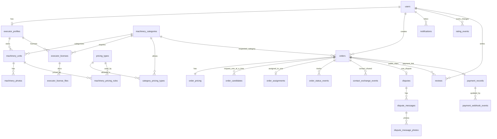

# Доменная модель и ERD (MVP)

## 1) Цель

Минимальная модель MVP: без обязательной безопасной сделки, без внутреннего кошелька, без календаря занятости. Выровнена с `USER_SCENARIOS.md`.

## 2) Сущности

### `users`

- `id`, `phone` (unique, логин), `full_name`;
- `current_mode` (`client` | `executor`) — единственное поле роли; задаётся при регистрации, меняется переключением;
- `contact_phone` (nullable);
- `telegram_url`, `whatsapp_url`, `max_url` (nullable);
- `messengers_json` (доп. пары `{ name, url }`);
- `rating_as_client`, `rating_as_executor` (внутренние, в UI нет);
- `blocked_at`, `blocked_reason` (nullable, бан админом);
- `created_at`, `updated_at`.

Нет `default_mode`, `is_client_enabled`, `is_executor_enabled`.

Для создания и принятия заказа: непустой `full_name` и хотя бы один канал из `contact_phone` / `telegram_url` / `whatsapp_url` / `max_url` / непустого `messengers_json`.

### `executor_profiles`

- `user_id` unique, `avatar_url`, `about`;
- `accepts_urgent_orders` (bool) — чекбокс «принимаю срочные заказы» на экране профиля; меняет только сам исполнитель;
- `subscription_status` (`none`, `active`, `paused`, `expired`);
- `subscription_expires_at` (nullable);
- `created_at`, `updated_at`.

Создаётся при регистрации в режиме исполнителя или при первом переключении на исполнителя.

`accepts_urgent_orders = false` скрывает исполнителя только из выдачи по срочным заказам; по плановым он виден. Система этот флаг не переключает.

Пока `executor_subscription_enabled = false`, статус подписки не ограничивает поиск.

### `machinery_categories`

Строка таблицы **и есть** конфиг типа транспорта. Отдельного JSON `license_config` нет.

- `id`;
- `code` unique — внутреннее системное обозначение типа транспорта;
- `name_ru` — текст для интерфейса;
- `license_category` (nullable) — категория водительских прав (например `B`); `null` — лицензия для типа не нужна;
- `is_active`;
- `created_at`, `updated_at`.

Селект при создании машины — строки этой таблицы.

### `pricing_types`

- `code` PK (`hour`, `shift`, `day`, `month`, `trip`, `km`);
- `name_ru`.

### `category_pricing_types`

- `category_id`, `pricing_type_code` — PK;
какие тарифы разрешены типу. Источник истины для UI и API, не хардкод клиента.

### `machinery_units`

- `id`, `executor_profile_id`, `category_id`;
- `address_text`, `location_lat`, `location_lng`;
- `deleted_at` (nullable, мягкое удаление);
- `created_at`, `updated_at`.

Лимита единиц нет. Флага занятости на единице нет.

### `machinery_photos`

- `id`, `machinery_unit_id`, `url`, `sort_order`;
- `created_at`.

Файлы загружает исполнитель, в API с клиента URL не принимаются.

### `machinery_pricing_rules`

- `id`, `machinery_unit_id`, `pricing_type`, `base_rate` (> 0), `currency`;
- `is_active`;
- unique активных `(machinery_unit_id, pricing_type)`.

Тариф принадлежит единице.

В поиске единица участвует только если: не удалена, подписка ок (если флаг), есть нужный тариф, лицензия категории `approved` либо `license_category` пустой, и для срочного поиска — `accepts_urgent_orders`.

### `executor_licenses`

Одна лицензия на пару исполнитель + категория (не на каждую машину).

- `id`;
- `executor_profile_id`;
- `category_id`;
- `license_category` (копия с строки категории на момент подачи);
- `status` (`pending`, `approved`, `rejected`);
- `reject_comment` (nullable);
- `reviewed_by_admin` (nullable);
- `created_at`, `updated_at`.

Уникально `(executor_profile_id, category_id)`. Документы — `executor_license_files` (`license_id`, `url`, `created_at`).

Машину без `approved` сохранить можно, в поиске нет.

### `orders`

- `status`: `draft`, `published`, `in_negotiation`, `awaiting_payment`, `in_progress`, `completed`, `disputed`, `cancelled`;
- `client_user_id`, `category_id`, `settlement_mode` (`direct_payment` | `secure_deal`);
- `search_mode` (`urgent` | `planned`);
- `planned_start_at` (timestamptz, nullable; обязательно при `planned`, пусто при `urgent`) — дата и время начала из календаря, **только для информации** исполнителю; сервер по нему ничего не считает;
- `details_version` (int, default 1);
- `address_text`, `location_lat`, `location_lng`, `description`;
- `terms_confirm_deadline_at` (nullable; вход в `in_negotiation` + 1 сутки, сброс при правке деталей);
- `payment_deadline_at` (nullable; «подтвердить условия» + 1 сутки при `secure_deal`);
- `execution_confirmed_by_client_at`, `execution_confirmed_by_executor_at`;
- `execution_confirm_deadline_at` (nullable) — внутренний таймер автоприёмки: время первого из двух подтверждений «работа выполнена» + 1 сутки;
- `cancel_*`, `cancelled_by_user_id`, `cancelled_by_role` (`client` | `executor` | `system`);
- `repeated_from_order_id`;
- `created_at`, `updated_at`.

Нет статуса `assigned`. Нет окна работ, окончания и полей занятости.

### `order_pricing`

Один к заказу. Сумму считает сервер.

- `pricing_type`, `quantity` (> 0), `unit_rate`, `computed_amount` (`unit_rate × quantity`), `currency`.

### `order_candidates`

- `id`, `order_id`, `executor_user_id`, `machinery_unit_id`;
- `candidate_status`: `notified`, `accepted`, `declined`, `auto_declined`, `expired`, `withdrawn`, `negotiation_rejected`, `terms_expired`;
- `notified_at`, `response_deadline_at` (`notified_at` + 5 минут);
- `accepted_at` (nullable);
- `reject_reason_code`, `reject_reason_text` (nullable);
- `created_at`, `updated_at`.

Статуса `viewed` нет. `auto_declined` — система закрыла запрос, потому что исполнитель принял другой срочный заказ; для клиента это отказ, штрафа исполнителю нет.

На заказ не более одного `notified`. Один исполнитель может одновременно быть `notified` по нескольким заказам. Assignment при «подтвердить условия»; при возврате на поиск снимается.

### `order_assignments`

- `id`, `order_id` unique, `executor_user_id`, `machinery_unit_id`;
- `created_at`.

Появляется при «подтвердить условия». Снимается, если заказ вернулся в `published` (неоплата и т.п.) — на `in_progress` назначение уже не снимается.

### `order_status_events`

- `id`, `order_id`, `from_status`, `to_status`, `event_type`, `actor_user_id` (nullable), `payload_json`, `created_at`.

### `contact_exchange_events`

- `id`, `order_id`, `created_at` — фиксация, что контакты открыты (первое «принять»).

### `disputes`

Одна запись на заказ (`order_id` unique).

- `opened_by_user_id` (nullable, если открыл провайдер);
- `reason_code`, `reason_text`;
- `status` (`open`, `closed`);
- `appeal_used` (bool);
- `closed_to_status`, `closed_by_admin`;
- `created_at`, `updated_at`.

Апелляция: та же строка снова `open`, `appeal_used = true`, сообщения продолжаются. Второго спора-строки нет.

### `dispute_messages` / `dispute_message_photos`

Сообщения спора (`author_kind`: client | executor | admin) и фото к сообщению.

### `reviews`

После `completed`, по одному отзыву каждой стороны.

- `order_id`, `from_user_id`, `to_user_id`, `author_role` (`client` | `executor`);
- `stars` (1–5), `body` (nullable);
- unique `(order_id, from_user_id)`.

### `notifications`

- `id`, `user_id`, `type`, `payload_json`, `read_at` (nullable), `created_at`.

Прочтение не меняет статус кандидата.

### `rating_events`

Правила — `RATING_PLAN.md`.

- `id`, `user_id`, `role` (`client` | `executor`), `event_type`, `delta`, `order_id` (nullable), `created_at`.

### `payment_records` / `payment_webhook_events`

- `payment_records`: `order_id`, `provider_code`, `provider_payment_id`, `payment_status`, сумма = `computed_amount`, `created_at`, `updated_at`.
- `payment_webhook_events`: `provider_event_id` unique, сырое тело, обработан.

Холд только после создания платежа на `awaiting_payment`. Клиент сумму не задаёт.

### `subscription_payments` (когда флаг подписки включён)

Платёж активации исполнителя, не холд заказа. Webhook → `subscription_status = active`.

## 3) ERD

## 4) Инварианты

- Один аккаунт — клиент и исполнитель; UI от `current_mode`.
- Неограниченный парк; тарифы на единице; набор тарифов задаёт тип транспорта.
- Контакты скрыты до первого accept; минимум имя + один канал.
- Лицензия одна на категорию; без `approved` машины категории не в поиске.
- Свою технику заказать нельзя. Заблокированный не ищет и не принимает.
- Цена заказа = ставка × количество, не ручной ввод.
- Календаря занятости нет: у `urgent` нет даты; у `planned` дата и время начала только для информации.
- Срочный поиск показывает только `accepts_urgent_orders = true`; флаг меняет только исполнитель.
- На один заказ один ожидающий кандидат; у одного исполнителя может быть несколько ожидающих запросов. Принял срочный — остальные срочные `auto_declined`.
- Пока не `in_progress`, срыв матча возвращает заказ в поиск. После `in_progress` поиск на этом заказе нельзя.
- Не ответил за 5 минут = отказ (скрыт, повторно нельзя).
- Один `disputes` на заказ. Отмена `in_progress` только через спор.
- Деньги: источник истины — провайдер. Нет платежа — нет возврата холда провайдером. После `captured` админ деньги не двигает.

## 5) Индексы и ограничения

Обязательные:
- `users.phone` unique;
- `executor_profiles.user_id` unique;
- `machinery_categories.code` unique;
- `category_pricing_types(category_id, pricing_type_code)` PK;
- `machinery_pricing_rules(machinery_unit_id, pricing_type)` unique среди активных;
- `executor_licenses(executor_profile_id, category_id)` unique;
- `order_candidates`: не более одного `notified` на заказ; запрет нового запроса при `declined` / `auto_declined` / `expired` / `negotiation_rejected` / `terms_expired`;
- `disputes.order_id` unique;
- `reviews(order_id, from_user_id)` unique;
- `payment_webhook_events.provider_event_id` unique;
- `payment_records(provider_code, provider_payment_id)` unique.

Рекомендуемые:
- `orders(status)`, `orders(client_user_id, status)`, `orders(search_mode, status)`;
- `machinery_units(executor_profile_id)`, `machinery_units(location_lat, location_lng)` (позже PostGIS);
- `executor_profiles(accepts_urgent_orders, subscription_status)`;
- `order_candidates(executor_user_id, candidate_status)` — для автоотказа остальных срочных запросов при принятии;
- `order_candidates(response_deadline_at)`, `orders(terms_confirm_deadline_at)`, `orders(execution_confirm_deadline_at)`;
- `orders(cancel_reason_code)`, `orders(cancelled_by_role)`;
- `orders(repeated_from_order_id)`;
- `notifications(user_id, created_at)`;
- `reviews(to_user_id)`;
- `executor_licenses(status)` для очереди админки.

## 6) Отложить

- Календарь занятости исполнителя / техники (в MVP только ручной флаг срочных заказов).
- Показ внутреннего рейтинга в UI.
- `Company*`.
