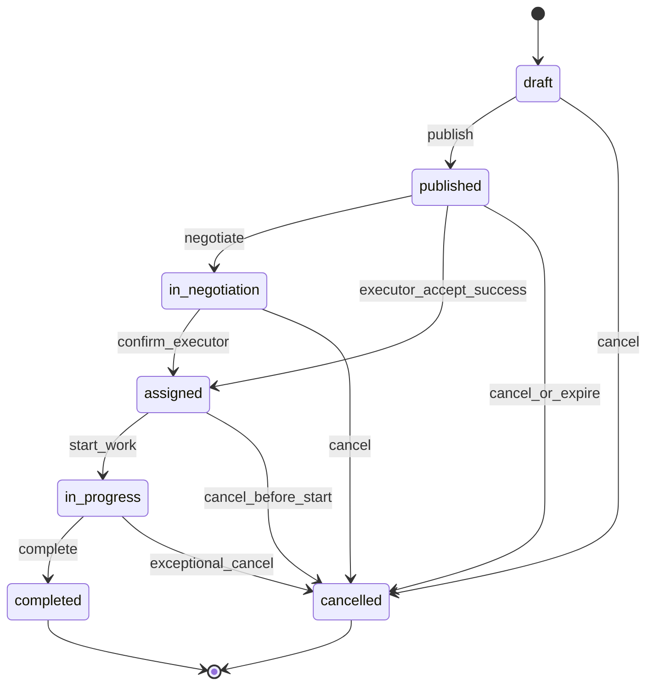

# Конечный автомат заказа и платежа (MVP)

## 1) Цель

Определить однозначные переходы статусов заказа и правила конкурентности, чтобы:
- поддерживать срочные и плановые заказы;
- рассылать заказ нескольким исполнителям;
- гарантировать единственное назначение;
- не блокировать MVP из-за необязательной «Безопасной сделки».

## 2) Состояния заказа

- `draft` — заказ создан, но не опубликован.
- `published` — заказ опубликован и отправлен кандидатам.
- `in_negotiation` — идет уточнение условий/цены.
- `assigned` — выбран один исполнитель.
- `in_progress` — исполнитель начал выполнение.
- `completed` — заказ завершен.
- `cancelled` — заказ отменен.

## 3) Допустимые переходы заказа

- `draft -> published`
- `draft -> cancelled`
- `published -> in_negotiation`
- `published -> assigned`
- `published -> cancelled`
- `in_negotiation -> assigned`
- `in_negotiation -> cancelled`
- `assigned -> in_progress`
- `assigned -> cancelled` (до старта работ по правилам)
- `in_progress -> completed`
- `in_progress -> cancelled` (исключительные случаи по правилам)

Недопустимые переходы должны возвращать ошибку `409 INVALID_STATE_TRANSITION`.

## 4) Состояния платежа (`secure_deal`)

- `not_required` — оплата через приложение не используется.
- `pending` — платеж создан, ожидается действие клиента.
- `authorized` — средства зарезервированы.
- `captured` — списание подтверждено.
- `failed` — ошибка оплаты.
- `cancelled` — платеж отменен.
- `refunded` — выполнен возврат.

Для `direct_payment` всегда используется `not_required`.

## 5) Правила конкурентности назначения

### Ключевой инвариант

У заказа может быть неограниченное число кандидатов, но только одно назначение.

### Механика защиты от двойного назначения

1. Эндпоинт принятия вызывается с `Idempotency-Key`.
2. В транзакции выполняется:
   - чтение заказа `FOR UPDATE` (или эквивалентный механизм);
   - проверка, что статус допускает назначение (`published` или `in_negotiation`);
   - попытка вставить запись в `order_assignments` (уникальный индекс по `order_id`);
   - перевод `orders.status` в `assigned`;
   - запись события в `order_status_events`.
3. Если уникальный индекс уже занят, вернуть `409 ORDER_ALREADY_ASSIGNED`.
4. Повтор с тем же `Idempotency-Key` возвращает исходный результат без повторного эффекта.

## 6) Диаграмма автомата заказа (Mermaid)

## 7) Связь статусов заказа и платежа

### Сценарий `direct_payment`

- Заказ проходит обычный цикл.
- Платежный статус фиксирован: `not_required`.

### Сценарий `secure_deal`

- До перехода в `in_progress` желательно иметь `authorized` или `captured` (по выбранной бизнес-логике).
- Переход в `completed` обычно сопровождается `captured`.
- При отмене до выполнения: `cancelled` или `refunded` в зависимости от состояния платежа.

## 8) Минимальные события аудита

Для каждого значимого шага писать событие в `order_status_events`:
- публикация;
- отклик кандидата;
- назначение;
- старт;
- завершение;
- отмена.

Для платежей фиксировать:
- создание платежа;
- каждый webhook;
- итоговый платежный статус.

## 9) Feature-флаги

Рекомендуемые флаги для поэтапного запуска:
- `secure_deal_enabled` — включает/выключает платежный контур;
- `planned_orders_enabled` — отдельно контролирует плановые заказы;
- `executor_subscription_enabled` — монетизация по подписке.
