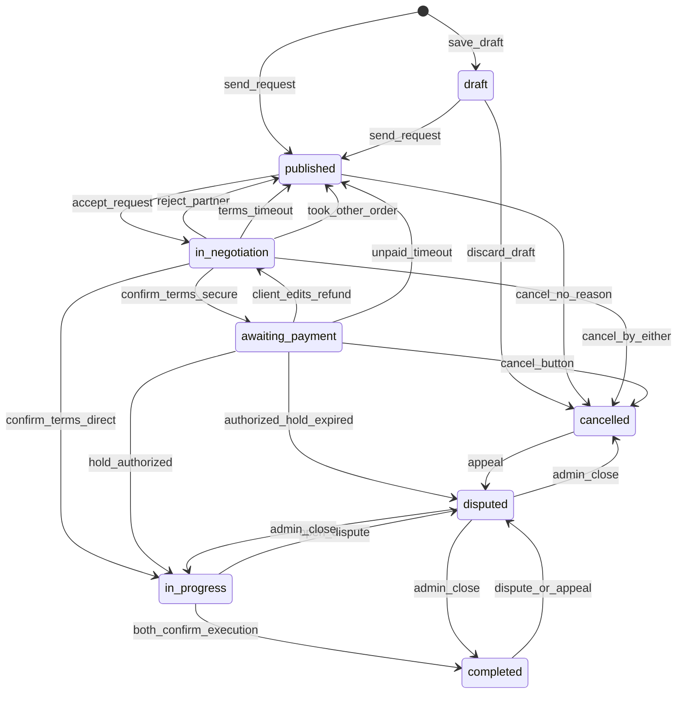

# Конечный автомат заказа и платежа (MVP)

## 1) Цель

Переходы статусов по `USER_SCENARIOS.md`.

## 2) Состояния заказа

- `draft` — сохранён, запрос не отправлен, в поиске исполнителей не участвует.
- `published` — идёт поиск исполнителя: ждут первое «принять» или клиент выбирает следующего. Сюда же заказ **возвращается**, если матч сорвался **до** `in_progress`.
- `in_negotiation` — запрос принят, контакты открыты. Заказчик правит детали, исполнитель жмёт «подтвердить условия» (срок **1 сутки**). Статуса `assigned` нет: сумму считает система.
- `awaiting_payment` — условия подтверждены, режим `secure_deal`, холд ещё не успешен. При `direct_payment` этого статуса нет.
- `in_progress` — работа идёт. Выход: обе стороны подтвердили исполнение, либо спор. Поиска на этом заказе больше нет.
- `completed` — обе подтвердили исполнение (или автоподтверждение молчащего). Отмены нет. Спор и отзывы доступны.
- `disputed` — открыт спор (одна запись на заказ). Пользователи не отменяют. Закрывает админ.
- `cancelled` — полная отмена кнопкой до работы, отказ от черновика, либо исход спора.

## 3) Возврат на поиск (пока не `in_progress`)

Пока заказ не в `in_progress`, срыв матча **не хоронит** заказ: тот же `orders`, статус `published`, клиент ищет другого. Полная отмена кнопкой по-прежнему переводит в `cancelled`.

Возврат на поиск:

- отказ исполнителя на запросе;
- таймаут 5 минут (не ответил = отказ);
- клиент снял запрос (`withdrawn`);
- отклонение партнёра в переговорах;
- исполнитель не подтвердил условия за 1 сутки;
- исполнитель принял **другой** заказ на пересекающееся время;
- клиент не оплатил безопасную сделку за 1 сутки.

После `in_progress` поиск на этом заказе не возобновляется. Нужен новый заказ (`repeat`).

## 4) Допустимые переходы

- `draft -> published` — отправка запроса
- `draft -> cancelled` — отказ от черновика
- `published -> in_negotiation` — «принять запрос» до 5 минут
- `published -> cancelled` — отмена без причины
- `in_negotiation -> in_negotiation` — заказчик сохранил правку (`details_version++`, сброс подтверждения, дедлайн подтверждения условий заново +1 сутки)
- `in_negotiation -> published` — отклонение партнёра, таймаут подтверждения условий, исполнитель принял другой заказ
- `in_negotiation -> cancelled`
- `in_negotiation -> awaiting_payment` — «подтвердить условия», `secure_deal`
- `in_negotiation -> in_progress` — «подтвердить условия», `direct_payment`
- `awaiting_payment -> in_negotiation` — заказчик изменил детали: отменить/вернуть холд или незавершённый платёж, версия++, исполнителю снова подтверждать
- `awaiting_payment -> in_progress` — холд `authorized`
- `awaiting_payment -> published` — таймаут 1 сутки без оплаты: платёж отменить, клиенту −3, тот же заказ снова в поиске
- `awaiting_payment -> cancelled` — отмена кнопкой (если был платёж/холд — отменить/вернуть)
- `awaiting_payment -> disputed` — **только если** платёж уже `authorized` и провайдер вернул холд по `expires_at` (на практике после `authorized` заказ уже `in_progress`; этот переход — защита, если статус платежа и заказа разошлись)
- `in_progress -> completed` — оба подтвердили исполнение (или автоподтверждение через 1 сутки после первого)
- `in_progress -> disputed` — спор
- `completed -> disputed` — спор или апелляция
- `cancelled -> disputed` — только апелляция
- `disputed -> completed` | `cancelled` | `in_progress` — только админка

Нельзя:

- спор из `draft` / `published` / `in_negotiation` / `awaiting_payment`;
- отмена кнопкой из `in_progress` / `completed` / `disputed`;
- вернуть заказ в `published` после начала работы;
- «подтвердить условия» с устаревшим `details_version` (`409 STALE_ORDER_DETAILS`).

Не меняют статус заказа (остаётся `published`):

- отказ или таймаут 5 минут на первом запросе → кандидат закрыт; исполнителю **−3**;
- клиент снял запрос до ответа → `withdrawn`.

`409 INVALID_STATE_TRANSITION`  
`409 ORDER_NO_LONGER_RELEVANT`  
`409 CANCEL_NOT_ALLOWED`  
`409 DISPUTE_NOT_ALLOWED`  
`409 APPEAL_LIMIT_REACHED` / `409 APPEAL_NOT_ALLOWED`  
`409 UNIT_OCCUPIED` — слот единицы уже занят (принял другой заказ)

## 5) Платёж (`secure_deal`)

- `not_required` — всегда для `direct_payment`.
- `pending`, `authorized`, `captured`, `failed`, `cancelled`, `refunded`.

Холд создаётся **после** «подтвердить условия», на `awaiting_payment`, когда клиент открыл оплату. Сумма всегда `order_pricing.computed_amount`, клиент сумму не передаёт. Пока клиент не создал платёж, у провайдера нет холда и **нечего возвращать**.

Истечение **наших** суток без оплаты → заказ **`published`** (поиск исполнителя), платёж `cancelled`, клиенту −3, без `disputed` и без `cancelled` заказа.

Правка деталей на `awaiting_payment`: отменить `pending` / вернуть холд, если уже есть; заказ → `in_negotiation`.

`expires_at` провайдера имеет смысл только при `authorized`. Тогда возврат холда провайдером → заказ `disputed`, ждём админа.

Оба подтвердили `completed` (или автоподтверждение) — выплата (`captured`). После `captured` платформа **больше не двигает деньги**: админ в споре может только санкции (рейтинг, блокировка), не возврат и не повторную выплату.

Закрытие спора админом:

- холд ещё `authorized` (не `captured`) — админ может выплатить или вернуть, как раньше;
- уже `captured` — денег не трогать, только статус заказа и санкции к пользователям;
- платежа не было — денег нет.

## 6) Кандидаты, версии, повтор

На `published` не более одного кандидата `notified`. Статуса `viewed` нет: открытие из уведомления ничего не меняет. Принял — принял, отказал — отказал, не ответил за 5 минут — это отказ.

Статусы кандидата: `notified`, `accepted`, `declined`, `expired`, `withdrawn`, `negotiation_rejected`, `terms_expired`, `lost_to_other_order`.

Повтор тому же исполнителю на этот заказ:

- нельзя после `declined`, `expired`, `negotiation_rejected`, `terms_expired` (не ответил / не подтвердил = отказ, скрыт);
- можно после `withdrawn` (клиент сам снял);
- можно после `lost_to_other_order`, если единица снова свободна в окне (поиск сам скрывает, пока слот занят).

Первый ответ: `response_deadline_at = notified_at + 5 минут`. Плановый заказ — тот же таймер.

Подтверждение условий: `terms_confirm_deadline_at = момент входа в in_negotiation + 1 сутки` (сбрасывается при правке деталей). Не подтвердил — кандидат `terms_expired`, заказ `published`, исполнитель скрыт, исполнителю **−3**.

`details_version` начинается с 1 при переходе в `in_negotiation`. Правка заказчика: +1, исполнителю уведомление. «Подтвердить условия» передаёт `details_version`; несовпадение — `409 STALE_ORDER_DETAILS`.

`order_assignment` при «подтвердить условия». При возврате на поиск назначение снимается.

`execution_confirmed_by_client_at` / `execution_confirmed_by_executor_at`: когда оба не null — `completed`. Если один подтвердил, второй молчит 1 сутки — автоподтверждение. Дедлайн второго подтверждения: `execution_confirm_deadline_at` = время **первого** из двух подтверждений + 1 сутки. Это не «отзыв клиента», а срок, за который вторая сторона должна нажать «работа выполнена».

Repeat: с `cancelled`; с `completed` после фиксации исполнения. С `published` после срыва матча repeat не нужен — это тот же заказ.

### 6.1) Гонка двух запросов на одно время

`published` слот не занимает. Исполнителю могут одновременно прийти два и больше запроса с пересекающимся окном.

Кто первый атомарно нажал «принять» — тот в `in_negotiation`, слот единицы занят.

Остальным кандидатам на **эту же единицу** с пересекающимся окном:

- статус `lost_to_other_order`;
- клиентам уведомление: исполнитель принял другой заказ;
- их заказы → `published` (поиск продолжается на том же заказе).

Повторный `accept` на уже занятую единицу — `409 UNIT_OCCUPIED`, этот кандидат тоже `lost_to_other_order`, заказ клиента остаётся `published`.

## 7) Диаграмма

## 8) Аудит

`order_status_events`: черновик, запрос, снятие, принять/отказ/таймаут, правки деталей, подтвердить условия, холд, возврат холда, таймаут неоплаты (возврат в поиск), подтверждения исполнения, спор, апелляция, отмена.

Рейтинг — `RATING_PLAN.md`. Таймаут 5 минут и таймаут подтверждения условий: исполнителю **−3**. Неоплата: клиенту **−3**.

## 9) Feature-флаги

- `secure_deal_enabled` — без флага только `direct_payment`, нет `awaiting_payment`.
- `executor_subscription_enabled` — в MVP **выключен**; включение требует оплаты подписки для приёма заказов.
