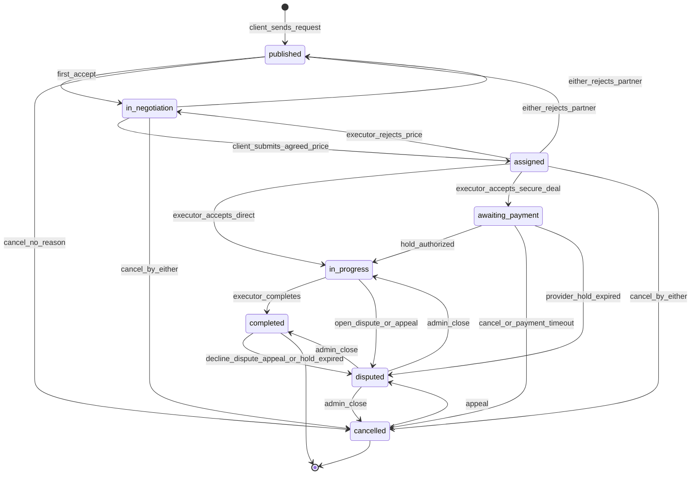

# Конечный автомат заказа и платежа (MVP)

## 1) Цель

Переходы статусов по `USER_SCENARIOS.md`.

## 2) Состояния заказа

- `published` — ожидание первого ответа или клиент выбирает следующего исполнителя (только пока не началась работа; после срыва с `in_progress`+ поиск в этом заказе нельзя).
- `in_negotiation` — первое принятие, контакты открыты, переговоры. Сюда же возврат, если исполнитель отклонил подтверждение цены.
- `assigned` — заказчик отправил оговоренную цену на подтверждение. Таймера нет.
- `awaiting_payment` — оба приняли цену, режим `secure_deal`, холд ещё не успешен. Клиент видит форму оплаты, исполнитель — что заказ не оплачен. Срок оплаты 1 сутки, иначе автоотмена. При `direct_payment` этого статуса нет.
- `in_progress` — работа началась (`direct_payment` сразу после принятия цены; `secure_deal` после успешного холда).
- `completed` — исполнитель сдал заказ. Отмены нет. Клиент за 1 сутки принимает или не принимает работу; молчание → автоприёмка. Непринятие → `disputed`. После принятия заказ остаётся `completed`, кнопка спора остаётся.
- `disputed` — спор или апелляция. Пользователи не отменяют. Закрывает админ из админки. На заказ максимум два треда (спор + одна апелляция).
- `cancelled` — полная отмена до начала работы, автоотмена за неоплату, либо исход спора в админке. С `cancelled` можно апелляцию, если лимит не исчерпан.

## 3) Допустимые переходы заказа

- `published -> in_negotiation` — первое «принять» до истечения 5 минут
- `published -> cancelled` — отмена кнопкой **без причины**
- `in_negotiation -> assigned`
- `in_negotiation -> published` — отклонение партнёра (поиск в этом заказе)
- `in_negotiation -> cancelled`
- `assigned -> in_progress` — исполнитель принял цену, `direct_payment`
- `assigned -> awaiting_payment` — исполнитель принял цену, `secure_deal`
- `assigned -> in_negotiation` — исполнитель не согласился с ценой
- `assigned -> published` — отклонение партнёра
- `assigned -> cancelled`
- `awaiting_payment -> in_progress` — холд успешен
- `awaiting_payment -> cancelled` — отмена кнопкой **или** автоотмена через 1 сутки без оплаты
- `awaiting_payment -> disputed` — провайдер вернул холд по `expires_at`
- `in_progress -> completed` — исполнитель сдал заказ
- `in_progress -> disputed` — кнопка спора или апелляция
- `completed -> disputed` — клиент не принял работу, кнопка спора, апелляция, либо `expires_at`
- `cancelled -> disputed` — только апелляция (лимит 1)
- `disputed -> completed` — только админка
- `disputed -> cancelled` — только админка
- `disputed -> in_progress` — только админка

Нельзя:
- спор из `published` / `in_negotiation` / `assigned` / `awaiting_payment`;
- отмена кнопкой из `in_progress` / `completed` / `disputed`;
- `disputed -> published` и любой новый поиск исполнителей на этом же заказе после начала работы;
- отмена из `completed`.

Не меняют статус заказа:
- отказ или таймаут 5 минут на первом запросе → кандидат закрыт, заказ `published`; исполнителю −2 к рейтингу за таймаут;
- клиент снял запрос до ответа → кандидат закрыт, заказ `published`.

`409 INVALID_STATE_TRANSITION` на недопустимый переход.  
`409 ORDER_NO_LONGER_RELEVANT` — исполнитель открыл заказ, по которому он уже не актуальный кандидат.  
`409 CANCEL_NOT_ALLOWED` — отмена кнопкой на запрещённом статусе.  
`409 DISPUTE_NOT_ALLOWED` — спор не с `in_progress` / `completed` (апелляция — отдельно).  
`409 APPEAL_LIMIT_REACHED` — апелляция уже использована.  
`409 APPEAL_NOT_ALLOWED` — нет закрытого админом спора.

## 4) Состояния платежа (`secure_deal`)

- `not_required` — для `direct_payment` всегда.
- `pending`, `authorized`, `captured`, `failed`, `cancelled`, `refunded`.

Холд создаётся на `awaiting_payment`, после того как оба приняли оговорённую цену. До успешного холда заказ не `in_progress`.

Клиент подтвердил `completed` **или** сработал таймаут 1 сутки (автоприёмка) — выплата исполнителю (`captured` / payout). Автоприёмка: исполнителю плюс успешного заказа, клиенту **−3** (`late_confirm`). Автоотмена неоплаты: клиенту **−3** (`payment_timeout`).

Спор / апелляция на `in_progress` / `completed` / `cancelled` (апелляция) или автопереход из-за `expires_at`:
- статус заказа → `disputed`;
- новый тред (у заказа уже может быть закрытый);
- деньги не двигать, пока админ не закроет: исход **следует решению** (`completed` — выплата или оставляем выплаченное; `cancelled` — возврат, в том числе уже выплаченного).

Закрытие спора (только админка, статусы `completed` | `cancelled` | `in_progress`):
- целевой статус `completed` — выплата исполнителю, если ещё не выплачено; рейтинг успешного заказа один раз на заказ;
- целевой статус `cancelled` — возврат клиенту;
- целевой статус `in_progress` — холд/выплата сами не меняются.

После закрытия стороны могут один раз открыть апелляцию (новый тред, заказ снова `disputed`). Второго раза нет.

Срок оплаты на `awaiting_payment`: `payment_deadline_at` = вход в статус + **1 сутки**. Истечение → `cancelled`, `cancelled_by_role = system`, минус клиенту. Если платёж уже создан — отменить/вернуть.

Срок ответа на сдачу: `completion_review_deadline_at` = вход в `completed` + **1 сутки**. Истечение → автоприёмка (как `confirmed`). Оба срока — в правилах сервиса.

## 5) Кандидаты, таймер, повтор

На `published` не более одного кандидата в `notified` / `viewed`.

Статусы кандидата:
- `notified`, `viewed`;
- `accepted` — первое принятие;
- `declined` — отказ исполнителя на первом запросе;
- `expired` — нет ответа 5 минут;
- `withdrawn` — клиент снял запрос до ответа;
- `negotiation_rejected` — клиент или исполнитель отклонил переговоры.

Правила повторного запроса тому же исполнителю на этот заказ:
- после `declined` или `negotiation_rejected` — нельзя, в поиске по заказу скрыт;
- после `expired` — можно (новая запись кандидата);
- после `withdrawn` — можно;
- на `assigned` и `in_negotiation` отклонение партнёра любой стороной = `negotiation_rejected`.

Первый ответ: `response_deadline_at = notified_at + 5 минут`. Гонка accept/expiry атомарна. На `assigned` и `awaiting_payment` таймера первого ответа нет.

Срок ответа клиента на сдачу работы: `completion_review_deadline_at` = момент перехода в `completed` + **1 сутки**; иначе автоприёмка.  
Срок оплаты: `payment_deadline_at` = вход в `awaiting_payment` + **1 сутки**; иначе автоотмена.

`order_assignment` создаётся, когда оба приняли цену: переход в `awaiting_payment` или сразу в `in_progress` при `direct_payment` (уникален по `order_id`).

Новый такой же заказ (`POST /orders/{id}/repeat`): с `cancelled`; с `completed` только после принятия (клиент или автоприёмка). Старый заказ не переводится в `published`.

## 6) Диаграмма автомата заказа (Mermaid)

Спор только из `in_progress` и `completed` (плюс системный переход по `expires_at`). В `published` после спора заказ не возвращают. Закрытие с выбором статуса — только админка.

## 7) Аудит

Писать в `order_status_events`: запрос, снятие, первое принятие/отказ/таймаут, контакты, отказ переговоров, цена, `awaiting_payment`, холд, автоотмена неоплаты, завершение, подтверждение / автоприёмка, `disputed`, апелляция, отмена. Сообщения спора не дублировать статусом.

Отмена, спор, автоприёмка и автоотмена неоплаты обновляют рейтинги по `RATING_PLAN.md`. Таймаут 5 минут: исполнителю −2.

## 8) Feature-флаги

- `secure_deal_enabled` — без флага путь `awaiting_payment` не используется, только `direct_payment`.
- `executor_subscription_enabled`
