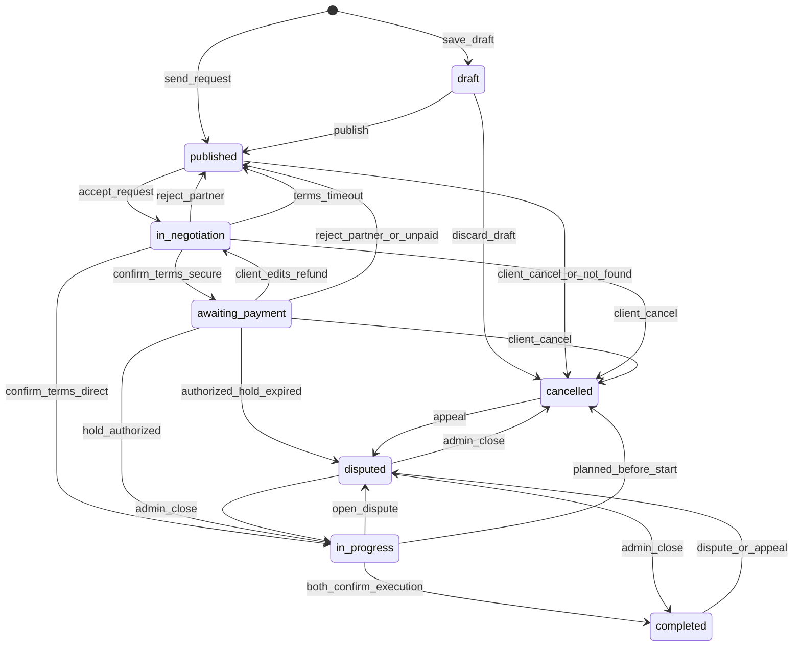

# Конечный автомат заказа и платежа (MVP)

## 1) Цель

Переходы статусов по `USER_SCENARIOS.md`.

## 2) Состояния заказа

- `draft` — сохранён, запрос не отправлен, в поиске исполнителей не участвует.
- `published` — идёт поиск исполнителя: кандидата ещё нет, ждут первое «принять» или клиент выбирает следующего. Сюда же заказ **возвращается**, если матч сорвался **до** `in_progress`.
- `in_negotiation` — запрос принят, контакты открыты. Заказчик правит детали, исполнитель жмёт «подтвердить условия» (срок **1 сутки**). Статуса `assigned` нет: сумму считает система.
- `awaiting_payment` — условия подтверждены, режим `secure_deal`, холд ещё не успешен. При `direct_payment` этого статуса нет.
- `in_progress` — работа идёт (для планового — с момента подтверждения условий, см. 4.1). Выход: обе стороны подтвердили исполнение, спор, либо отмена планового до даты начала.
- `completed` — обе подтвердили исполнение (или автоподтверждение молчащего). Отмены нет. Спор и отзывы доступны.
- `disputed` — открыт спор (одна запись на заказ). Пользователи не отменяют. Закрывает админ.
- `cancelled` — полная отмена клиентом до работы, отказ от черновика, отмена планового до даты начала, системная отмена (исполнитель не найден), отмена админом, либо исход спора.

## 3) Возврат на поиск (пока не `in_progress`)

Пока заказ не в `in_progress`, срыв матча **не хоронит** заказ: тот же `orders`, статус `published`, клиент ищет другого. Полную отмену делает только клиент (или система / админ).

Возврат на поиск:

- отказ исполнителя на запросе;
- таймаут 5 минут (не ответил = отказ);
- автоотказ: исполнитель принял другой **срочный** заказ (раздел 6.1);
- клиент снял запрос (`withdrawn`);
- отклонение партнёра любой стороной на `in_negotiation` или `awaiting_payment`;
- исполнитель не подтвердил условия за 1 сутки;
- клиент не оплатил безопасную сделку за 1 сутки.

После `in_progress` заказ в `published` не возвращается.

## 4) Допустимые переходы

- `draft -> published` — «опубликовать»: заказ в поиске **без кандидата**; запрос конкретной машине — отдельным действием
- `draft -> cancelled` — отказ от черновика
- `published -> in_negotiation` — «принять запрос» до 5 минут
- `published -> cancelled` — отмена клиентом без причины; **системная отмена** «исполнитель не найден» (раздел 4.2); отмена админом. Ожидающий кандидат, если есть, закрывается как `withdrawn`, исполнителю уведомление
- `in_negotiation -> in_negotiation` — заказчик сохранил правку (`details_version++`, цена пересчитана по текущим ставкам, сброс подтверждения, дедлайн подтверждения условий заново +1 сутки)
- `in_negotiation -> published` — отклонение партнёра (любая сторона), таймаут подтверждения условий
- `in_negotiation -> cancelled` — отмена **клиентом** с причиной; отмена админом
- `in_negotiation -> awaiting_payment` — «подтвердить условия», `secure_deal`
- `in_negotiation -> in_progress` — «подтвердить условия», `direct_payment`
- `awaiting_payment -> in_negotiation` — заказчик изменил детали: отменить/вернуть холд или незавершённый платёж, версия++, исполнителю снова подтверждать
- `awaiting_payment -> published` — отклонение партнёра (любая сторона; платёж отменить/вернуть); таймаут 1 сутки без оплаты (платёж отменить, клиенту −3)
- `awaiting_payment -> in_progress` — холд `authorized`
- `awaiting_payment -> cancelled` — отмена **клиентом** с причиной (платёж/холд отменить/вернуть); отмена админом
- `awaiting_payment -> disputed` — **только если** платёж уже `authorized` и провайдер вернул холд по `expires_at` (на практике после `authorized` заказ уже `in_progress`; этот переход — защита, если статус платежа и заказа разошлись)
- `in_progress -> completed` — оба подтвердили исполнение (или автоподтверждение через 1 сутки после первого)
- `in_progress -> disputed` — спор
- `in_progress -> cancelled` — **только плановый до `planned_start_at`**, любая сторона, с причиной (раздел 4.1); отмена админом
- `completed -> disputed` — спор или апелляция
- `cancelled -> disputed` — только апелляция
- `disputed -> completed` | `cancelled` | `in_progress` — только админка

Нельзя:

- спор из `draft` / `published` / `in_negotiation` / `awaiting_payment`;
- полная отмена исполнителем на `in_negotiation` / `awaiting_payment` (у него только «отклонить партнёра»);
- отмена кнопкой из `in_progress` после начала работы (срочный — всегда; плановый — после `planned_start_at`), из `completed`, из `disputed`;
- вернуть заказ в `published` из `in_progress` и дальше;
- «подтвердить условия» с устаревшим `details_version` (`409 STALE_ORDER_DETAILS`).

Не меняют статус заказа (остаётся `published`):

- отказ или таймаут 5 минут на первом запросе → кандидат закрыт; исполнителю **−3** за таймаут;
- автоотказ (исполнитель принял другой срочный заказ) → кандидат закрыт, штрафа нет;
- клиент снял запрос до ответа → `withdrawn`;
- клиент правит фильтр заказа, пока нет ожидающего кандидата.

`409 INVALID_STATE_TRANSITION`  
`409 ORDER_NO_LONGER_RELEVANT`  
`409 CANCEL_NOT_ALLOWED`  
`409 DISPUTE_NOT_ALLOWED`  
`409 APPEAL_LIMIT_REACHED` / `409 APPEAL_NOT_ALLOWED`

### 4.1) Плановый заказ до даты начала

После «подтвердить условия» плановый заказ сразу `in_progress`, хотя работа начнётся в `planned_start_at`. До этого момента обе стороны могут **отменить заказ с причиной** (коды — как для `awaiting_payment`, `CANCELLATION_REASONS.md`), заказ → `cancelled`, холд при сделке возвращается. Отменил исполнитель — клиенту уведомление с «искать снова?».

С момента `planned_start_at` — только спор. У срочного заказа окна отмены нет.

### 4.2) Исполнитель не найден

Заказ в `published` без ожидающего кандидата автоматически отменяется системой:

- срочный — через **24 часа без активности клиента** по этому заказу: `search_activity_at` обновляется при входе в `published`, при каждой отправке запроса исполнителю и при правке заказа; отказ исполнителя таймер не сбрасывает, следующий запрос клиента — сбрасывает;
- плановый — при наступлении `planned_start_at`; если в этот момент есть кандидат `notified`, ждём его исход (≤ 5 минут), затем отменяем, если заказ всё ещё `published`.

`cancelled_by_role = system`, причины нет, штрафа нет, клиенту уведомление с «искать снова?».

## 5) Платёж (`secure_deal`)

- `not_required` — всегда для `direct_payment`.
- `pending`, `authorized`, `captured`, `failed`, `cancelled`, `refunded`.

Режим расчёта клиент выбирает на экране отправки запроса. `secure_deal` при выключенном `secure_deal_enabled` → `409 SECURE_DEAL_DISABLED`.

Холд создаётся **после** «подтвердить условия», на `awaiting_payment`, когда клиент открыл оплату. Сумма всегда `order_pricing.computed_amount`, клиент сумму не передаёт. Пока клиент не создал платёж, у провайдера нет холда и **нечего возвращать**.

Истечение **наших** суток без оплаты → заказ **`published`** (поиск исполнителя), платёж `cancelled`, клиенту −3, без `disputed` и без `cancelled` заказа.

Правка деталей или отклонение партнёра на `awaiting_payment`: отменить `pending` / вернуть холд, если уже есть.

`expires_at` провайдера имеет смысл только при `authorized`. Тогда возврат холда провайдером → заказ `disputed`, ждём админа.

**Открытый вопрос (срок холда).** У провайдера холд живёт ограниченное время. Если работа длиннее (тариф `month`, большое количество `day`), холд истечёт раньше `completed`, и заказ уйдёт в `disputed` автоматически. Нужно проверить, позволяет ли ЮKassa задавать срок холда под заказ; до ответа ограничений на безопасную сделку по тарифу не вводим. Зафиксировано в `PRODUCT_FOUNDATION.md`, раздел 12.

Оба подтвердили `completed` (или автоподтверждение) — выплата (`captured`). После `captured` платформа **больше не двигает деньги**: админ в споре может только санкции (рейтинг, блокировка), не возврат и не повторную выплату.

Закрытие спора админом:

- холд ещё `authorized` (не `captured`) — админ может выплатить или вернуть;
- уже `captured` — денег не трогать, только статус заказа и санкции к пользователям; закрытие в `cancelled` **не** делает возврат;
- платежа не было — денег нет.

## 6) Кандидаты, версии, повтор

На один заказ не более одного кандидата `notified`. Статуса `viewed` нет: открытие из уведомления ничего не меняет. Принял — принял, отказал — отказал, не ответил за 5 минут — это отказ.

Статусы кандидата: `notified`, `accepted`, `declined`, `auto_declined`, `expired`, `withdrawn`, `negotiation_rejected`, `terms_expired`.

Повтор тому же исполнителю на этот заказ:

- нельзя после `declined`, `auto_declined`, `expired`, `negotiation_rejected`, `terms_expired` (отказ, автоотказ, не ответил, не подтвердил — скрыт по заказу);
- можно после `withdrawn` (клиент сам снял).

Первый ответ: `response_deadline_at = notified_at + 5 минут`. Плановый заказ — тот же таймер.

Подтверждение условий: `terms_confirm_deadline_at = момент входа в in_negotiation + 1 сутки` (сбрасывается при правке деталей). Не подтвердил — кандидат `terms_expired`, заказ `published`, исполнитель скрыт, исполнителю **−3**.

`details_version` начинается с 1 при переходе в `in_negotiation`. Правка заказчика: +1, `order_pricing` пересчитывается по **текущим** ставкам машины, исполнителю уведомление. «Подтвердить условия» передаёт `details_version`; несовпадение — `409 STALE_ORDER_DETAILS`. Изменение ставок исполнителем на машине само по себе заказ не трогает.

`order_assignment` при «подтвердить условия». При возврате на поиск назначение снимается.

`execution_confirmed_by_client_at` / `execution_confirmed_by_executor_at`: когда оба не null — `completed`. Если один подтвердил, второй молчит 1 сутки — автоподтверждение. `execution_confirm_deadline_at` = время **первого** из двух подтверждений + 1 сутки; это внутренний таймер для автоприёмки, пользователю не показывается и к отзывам не относится. Если до истечения таймера открыт спор — таймер отменяется, заказ `disputed`.

Repeat: с `cancelled`; с `completed` после фиксации исполнения. С `published` после срыва матча repeat не нужен — это тот же заказ.

### 6.1) Несколько запросов одному исполнителю

Календаря занятости нет, поэтому одному исполнителю могут одновременно висеть запросы от разных клиентов (по одному ожидающему на каждый заказ). Флаг «принимаю срочные заказы» и автоотказ работают на уровне **исполнителя**, не отдельной машины.

Исполнитель принял **срочный** заказ:

- все его остальные ожидающие (`notified`) запросы по **срочным** заказам — по любой его машине — → `auto_declined`;
- клиентам этих заказов уведомление: исполнитель отказался;
- их заказы остаются `published`, поиск продолжается; этот исполнитель по ним скрыт;
- ожидающие запросы по **плановым** заказам не трогаем — висят до ответа исполнителя или до 5-минутного таймаута.

Исполнитель принял **плановый** заказ — остальные запросы (срочные и плановые) не трогаем.

Штрафа за `auto_declined` нет. Флаг «принимаю срочные заказы» при этом **не меняется**: снимает и ставит его только сам исполнитель.

## 7) Диаграмма

Отмена админом возможна из любого статуса, кроме `completed` (на диаграмме не показана).

## 8) Аудит

`order_status_events`: черновик, публикация, запрос, снятие, принять/отказ/автоотказ/таймаут, правки деталей, подтвердить условия, холд, возврат холда, таймаут неоплаты (возврат в поиск), отмена «исполнитель не найден», подтверждения исполнения, спор, апелляция, отмена (клиент / плановый до начала / админ).

Рейтинг — `RATING_PLAN.md`. Таймаут 5 минут и таймаут подтверждения условий: исполнителю **−3**. Неоплата: клиенту **−3**. Автоотказ, «исполнитель не найден», отмена админом: **0**.

## 9) Feature-флаги

- `secure_deal_enabled` — без флага только `direct_payment`, нет `awaiting_payment`, переключатель на экране запроса скрыт.
- `executor_subscription_enabled` — в MVP **выключен**; включение требует оплаты подписки для приёма заказов.
